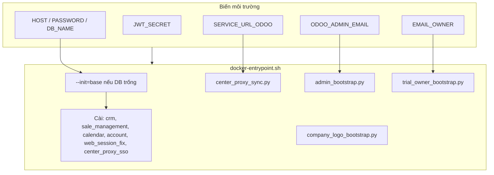

# odoo-dl — Odoo 17 Trial Image

Image Odoo 17 tự bootstrap DB, cài module business, SSO qua Zent Center Manager (JWT one-time), dùng cho trial env (Coolify) hoặc dev local.

## Cấu trúc thư mục

```
odoo-dl/
├── docker-compose.yml          # Production (Coolify + DB riêng, proxy Caddy)
├── docker-compose.local.yml    # Dev local: Postgres + Odoo
├── .env                        # Biến môi trường (không commit)
├── reset.txt                   # Lệnh reset DB local
└── addons/
    ├── docker/
    │   ├── Dockerfile
    │   ├── docker-entrypoint.sh
    │   └── odoo.conf.template
    ├── modules/
    │   ├── center_proxy_sso/        # JWT launch + login gate Zent
    │   ├── web_session_fix/         # Fix cookie session sau reset container
    │   └── chatwoot_crm/            # Tùy chọn (chưa auto-cài)
    └── scripts/
        ├── center_proxy_sync.py     # web.base.url từ SERVICE_URL_ODOO
        ├── admin_bootstrap.py       # Gán email/password admin
        ├── trial_owner_bootstrap.py # User trial (EMAIL_OWNER)
        └── company_logo_bootstrap.py
```

## Luồng khởi động container



## SSO — Zent Center Manager (`center_proxy_sso`)

| Thành phần | Mô tả |
|------------|--------|
| FastAPI `/api/odoo/launch` | Ký JWT HS256, redirect tab mới tới Odoo |
| `/web/sso/consume` | Verify JWT, ghi `jti` one-time, tạo session |
| `login_gate.py` | `/web/login` chỉ hiện form khi `?sso_login=false` |
| `web_session_fix` | Không reset session giữa lúc consume JWT |

**Biến `.env` cần cho SSO Odoo:**

```env
JWT_SECRET=...                        # Secret chung với FastAPI
SERVICE_URL_ODOO=https://trial.example.com
EMAIL_OWNER=trial-user@example.com    # User đăng nhập qua SSO
CENTER_TENANT_ID=...                  # Tuỳ chọn — validate tenant_id trong JWT
```

**JWT claims:** `email`, `tenant_id`, `jti`, `exp` (HS256).

**Luồng:**

1. User login Center → **Mở CRM**
2. Tab mới: `{SERVICE_URL_ODOO}/web/sso/consume?token=...`
3. Odoo verify → session → `/web`

**Dev bypass (password login):**

```
/web/login?sso_login=false
```

## Chạy local

```powershell
docker compose -f docker-compose.local.yml up -d --build
```

- Odoo: http://localhost:8069
- `.env`: `HOST=db`, `PASSWORD=odoo`, `SERVICE_URL_ODOO=http://localhost:8069`, `JWT_SECRET=...`

Reset sạch: xem `reset.txt`

## Production (Coolify)

```powershell
docker compose up -d --build
```

- DB Postgres do Coolify tạo riêng (cùng mạng `coolify`)
- Biến môi trường inject trực tiếp trên Coolify (không dùng `env_file`)
- Không expose port — proxy qua Caddy

## Module tự cài khi start

`crm`, `sale_management`, `calendar`, `account`, `web_session_fix`, `center_proxy_sso`

`chatwoot_crm` có trong repo nhưng **không** auto-cài — cài thủ công nếu cần.
