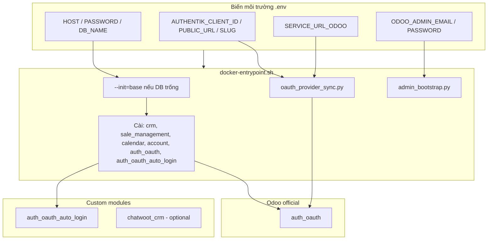

# odoo-dl — Odoo 17 Trial Image

Image Odoo 17 tự bootstrap DB, cài module business, SSO Authentik qua `auth_oauth`, dùng cho trial env (Coolify) hoặc dev local.

## Cấu trúc thư mục

```
odoo-dl/
├── docker-compose.yml          # Production (Coolify + DB riêng, proxy Caddy)
├── docker-compose.local.yml    # Dev local: Postgres + Odoo
├── .env                        # Biến môi trường (không commit)
├── reset.txt                   # Lệnh reset DB local
└── addons/
    ├── docker/
    │   ├── Dockerfile
    │   ├── docker-entrypoint.sh
    │   └── odoo.conf.template
    ├── modules/
    │   ├── auth_oauth_auto_login/   # Auto redirect /web/login → OAuth
    │   ├── center_proxy_sso/        # JWT launch + proxy prefix (iframe center)
    │   └── chatwoot_crm/            # Tùy chọn (chưa auto-cài)
    └── scripts/
        ├── oauth_provider_sync.py   # Tạo OAuth Provider từ .env
        ├── center_proxy_sync.py     # web.base.url qua center proxy
        └── admin_bootstrap.py       # Gán email/password admin
```

## Sơ đồ module & luồng khởi động



## SSO Authentik

| Thành phần | Mô tả |
|------------|--------|
| `auth_oauth` | Module chuẩn Odoo — OAuth Provider |
| `oauth_provider_sync.py` | Tự điền provider từ `.env` khi container start |
| `auth_oauth_auto_login` | Tự redirect `/web/login` → Authentik (không cần bấm nút) |

**Biến `.env` cần cho SSO:**

```env
AUTHENTIK_CLIENT_ID=...
AUTHENTIK_PUBLIC_URL=https://sso.example.com
AUTHENTIK_SLUG=your-app-slug
AUTHENTIK_SCOPE=openid profile email
SERVICE_URL_ODOO=https://trial.example.com
OAUTH_AUTO_LOGIN=1
```

**Redirect URI trên Authentik:**

```
{SERVICE_URL_ODOO}/auth_oauth/signin
```

**Admin bypass (không qua SSO):**

```
/web/login?no_sso=1
```

Tắt auto-redirect: `OAUTH_AUTO_LOGIN=0`

## Center Manager iframe (`center_proxy_sso`)

Odoo embed trong center manager qua reverse proxy: `/odoo/{tenant_id}/` → domain Odoo riêng.

| Thành phần | Mô tả |
|------------|--------|
| `center_proxy_sso` | Consume JWT one-time tại `/web/sso/consume`, prefix URL qua proxy |
| `center_proxy_sync.py` | `web.base.url` = `CENTER_PUBLIC_BASE_URL` khi có |

**Biến môi trường (Coolify / `.env`):**

```env
# URL public qua center (iframe same-origin)
CENTER_PUBLIC_BASE_URL=https://admin.zent.work/odoo/MONGO_TENANT_ID
CENTER_PROXY_PREFIX=/odoo/MONGO_TENANT_ID
CENTER_TENANT_ID=MONGO_TENANT_ID

# Secret chung với FastAPI (đã có trong deploy)
JWT_SECRET=...

# URL trực tiếp Odoo (OAuth callback, admin) — giữ nguyên
SERVICE_URL_ODOO=https://abc123.zent.work
```

**JWT claims (FastAPI phát — bước sau):** `email`, `tenant_id`, `jti`, `exp` (HS256).

**Luồng iframe:**

1. Center gọi FastAPI → nhận URL  
   `https://admin.zent.work/odoo/{tenant}/web/sso/consume?token=...`
2. Nginx proxy tới `https://{tenantDomain}/web/sso/consume?token=...`  
   + header `X-Script-Name: /odoo/{tenant}`
3. Odoo verify JWT, ghi `jti` (one-time), tạo session → redirect `/web`

**Nginx center (gợi ý):** cần `proxy_redirect` + `sub_filter` cho asset `/web/static/...`  
(vì Odoo sinh path tuyệt đối `/web/...`). Xem comment trong module.

**Cài module local:**

```powershell
docker exec odoo_tik odoo -d odoo -i center_proxy_sso --stop-after-init
```

## Chạy local

```powershell
docker compose -f docker-compose.local.yml up -d --build
```

- Odoo: http://localhost:8069
- `.env`: `HOST=db`, `PASSWORD=odoo`, `SERVICE_URL_ODOO=http://localhost:8069`

Reset sạch: xem `reset.txt`

## Production (Coolify)

```powershell
docker compose up -d --build
```

- DB Postgres do Coolify tạo riêng (cùng mạng `coolify`)
- Biến môi trường inject trực tiếp trên Coolify (không dùng `env_file`)
- Không expose port — proxy qua Caddy

## Module tự cài khi start

`crm`, `sale_management`, `calendar`, `account`, `auth_oauth`, `web_session_fix`, `center_proxy_sso`

`chatwoot_crm` có trong repo nhưng **không** auto-cài — cài thủ công nếu cần.
